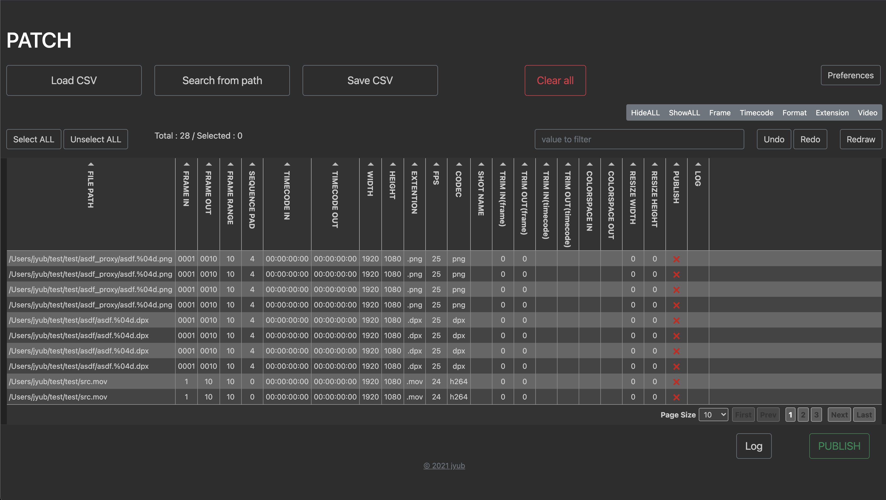
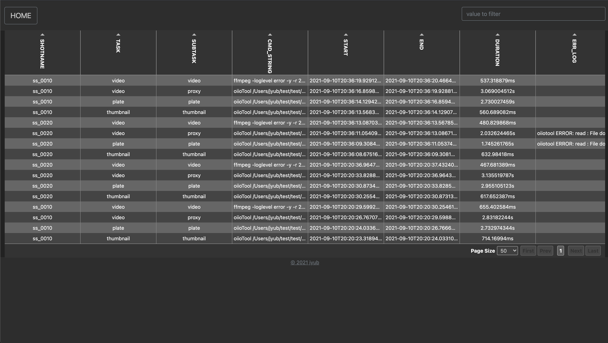
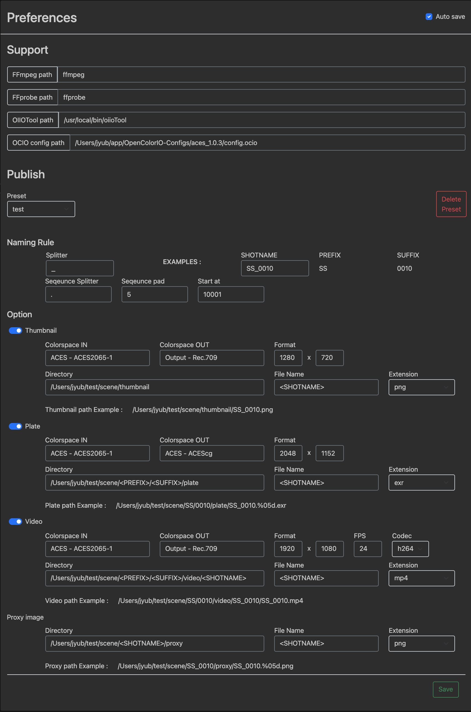

# PATCH

PATCH is a tool for publishing image data.
This tool uses 'OpenImageIO', 'FFmpeg', 'FFprobe' and 'OCIO'.

### Requirements
* [OpenImageIO](https://github.com/OpenImageIO)
* [FFmpeg](https://github.com/FFmpeg/FFmpeg)
* [FFprobe](https://github.com/FFmpeg/FFmpeg)
* [OCIO](https://github.com/AcademySoftwareFoundation/OpenColorIO)

### Tested on
* OpenImageIO 2.0.11
* FFmpeg 4.2.1
* FFprobe 4.2.1
* OCIO aces_1.0.3

### License
* patch: BSD 3-Clause License
* OpenImageIO: BSD 3-Clause License
* FFmpeg: GNU Lesser General Public License, version 2.1
* FFprobe: GNU Lesser General Public License, version 2.1
* OCIO: BSD 3-Clause License
* Tabulator: MIT license